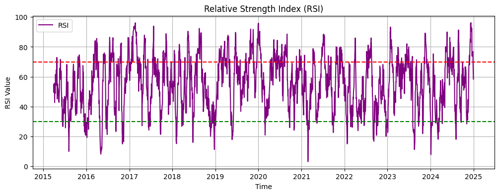

# 📈 Stock Price Trend Prediction using LSTM

This project predicts future stock prices using an LSTM neural network. It also includes technical indicators like Moving Average and RSI, and a live dashboard built using Streamlit.

---

## 🚀 Features

- Fetch stock data using Yahoo Finance
- Train LSTM on past 60 days of stock price
- Predict & visualize trends
- Compute 60-day Moving Average
- Compute Relative Strength Index (RSI)
- Live dashboard built using Streamlit

---

## 🛠 Tools Used

- Python, Pandas, NumPy
- Keras (LSTM)
- scikit-learn
- yfinance
- Matplotlib
- Streamlit
- Replit (for deployment)

---

## 📊 Live Dashboard

👉 [Click to view my Streamlit App](https://ddea86b5-580a-45c7-954f-24cf0a5d3cb7-00-1luhvlh2qhle9.pike.replit.dev/)

---

## 📄 Report

📥 [Download Report (Word - DOCX)](https://github.com/vishal-raj-k/stock-price-trend-prediction/blob/main/Stock_Trend_Prediction_Report_VishalRaj.docx)

---

## 📸 Screenshots

---

## 🙋‍♂️ Author

**Vishal Raj**  
AI/ML Intern | Fault Management Engineer  
📍 India
